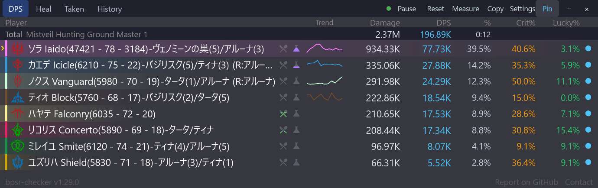

# bpsr-checker

**[日本語](./README.md) | [English](./README.en.md)**

**A lightweight DPS checker for Blue Protocol: Star Resonance (Windows only)**

[](https://github.com/Rererr/bpsr-checker/releases)
[](./LICENSE)
[](https://github.com/Rererr/bpsr-checker/releases)

[](https://discord.gg/exU3gPBx3)

Built with **Slint (a native Rust GUI)**. It focuses on just the features you actually need during combat and measurement, so it keeps CPU and memory usage low and stays smooth even over long sessions, while still letting you display a semi-transparent overlay on top of the game. **It never sends any data to external servers.**

<p align="center">
  
</p>

## Features

Feature details and screenshots are organized into separate pages.

### Metrics and measurement

- [DPS, healing, damage taken, and history tabs](docs/features/metrics-tabs.md)
- [Per-skill breakdown](docs/features/skill-breakdown.md)
- [Measurement mode](docs/features/measurement-mode.md)
- [Total row and content name](docs/features/total-row-content-name.md)
- [Effective DPS column](docs/features/effective-dps.md)
- [DPS trend graphs](docs/features/dps-trend.md)

### Player information and buffs

- [Battle Imagine names](docs/features/battle-imagine-names.md)
- [Imagine debuff timer](docs/features/imagine-debuff-timer.md)
- [Self buff/debuff overlay](docs/features/self-buffs-debuffs.md)
- [Self status overlay](docs/features/self-status.md)
- [Food and syrup display](docs/features/food-syrup.md)
- [Imagine-only mode](docs/features/imagine-only-mode.md)
- [Class icons](docs/features/class-icons.md)
- [Character selection](docs/features/character-selection.md)

### Display and controls

- [Row-bar display modes](docs/features/dps-bars.md)
- [Two-column compact layout](docs/features/compact-layout.md)
- [Overlay window controls](docs/features/overlay-window-controls.md)
- [Global shortcuts](docs/features/global-shortcuts.md)
- [Overlay appearance](docs/features/overlay-appearance.md)
- [Copy templates](docs/features/copy-templates.md)

### Other

- [Language support](docs/features/multilanguage.md)
- [In-app updates](docs/features/in-app-update.md)
- [Footer contact links](docs/features/contact-links.md)

> Feature pages are currently written in Japanese; the screenshots include both Japanese and English UI where relevant.

## Installation

Download the latest `bpsr-checker-setup-x.x.x.exe` (installer) from [Releases](https://github.com/Rererr/bpsr-checker/releases) and run it. There is also a no-install portable version, `bpsr-checker-portable-x.x.x.zip` (unzip and run `bpsr-checker.exe`).

- You can install updates without closing the running app.
- The installer build can check for and apply new versions from the Updates section of the settings panel ([In-app updates](docs/features/in-app-update.md)).
- Settings and history are preserved across reinstalls (`%APPDATA%\bpsr-checker`).

### Requirements

- Windows 10 / 11 (x64)
- Administrator privileges (required to load the WinDivert kernel driver)

## Safety & Privacy

Answers to common concerns about this tool.

### Will I get banned for using this?

**It does not modify any game files, memory, or network traffic.** It merely passively observes incoming packets and reconstructs the damage-display values — it performs no injection, patching, or automation against the game client.

That said, this is an **unofficial, individually-developed tool**, and the possibility that it stops being tolerated due to a future change in the operator's terms cannot be ruled out. **The final decision to use it is at your own risk.** (See the disclaimer at the end of the [License](#license) section.)

### Is it a virus? My antivirus flagged it

**It is a false positive.** It bundles the [WinDivert](https://github.com/basil00/WinDivert) driver, which captures packets at the kernel level, so some antivirus software may warn about it as a "network monitoring tool."

For example, on VirusTotal, Kaspersky may report `Not-a-virus:HEUR:RiskTool.Multi.WinDivert.gen`. This classifies the bundled WinDivert driver as "riskware" (a network tool) — it is **not malware** (note the `Not-a-virus` prefix).

What to do:
- Add the WinDivert driver (`WinDivert.dll`, `WinDivert64.sys`) and the install folder to your antivirus exclusions.
- If you are worried, you can review the [source code](https://github.com/Rererr/bpsr-checker) and [build it yourself](#building-from-source) (GPL-3.0).
- Every release is scanned on VirusTotal: [installer](https://www.virustotal.com/gui/file/dd0d44e8b4ab9465a956406fa9f6dfce648bdd76ed726f4b21f5eb596450198a/detection) · [portable](https://www.virustotal.com/gui/file/1d6cd64949b1515cd1a328390590f808b570f62315cacfedd1231da3d4db2992/detection).

### The download is blocked with "Virus detected"

**Please use the portable zip.** This warning currently affects **only the installer (`bpsr-checker-setup-*.exe`)** — the portable zip and its contents (the `bpsr-checker.exe` binary and WinDivert) are not flagged.

The block comes from **Windows Defender**, not from your browser. Its machine-learning heuristic flags the unsigned, freshly published NSIS installer as `Trojan:Win32/Wacatac.B!ml` (the `!ml` suffix marks a machine-learning inference). Both Chrome and Edge hand the finished download to the Windows antivirus for inspection, so **switching browsers changes nothing**. For the same reason, downloading directly via PowerShell or a command-line tool does not help — real-time protection removes the file anyway.

If you specifically need the installer:
1. Go to Windows Security → "Virus & threat protection" → "Manage settings" → "Add or remove exclusions" and temporarily exclude your download folder.
2. Verify that the SHA256 of the downloaded file matches the hash in the VirusTotal links above (`Get-FileHash <file> -Algorithm SHA256`). A match confirms a genuine, untampered release.
3. Remove the exclusion once installation is complete.

> False positives are reported to Microsoft as they are found, and get cleared in a definition update. However, each release has a new file hash, so the detection can reappear right after a new version ships.

### Windows SmartScreen shows "Windows protected your PC"

This app is currently **not code-signed**. As a solo project, the cost of obtaining and operating a certificate is hard to justify; this is under review. Unsigned apps trigger a SmartScreen warning until enough downloads accumulate to build reputation.

The full source is public under [GPL-3.0](https://github.com/Rererr/bpsr-checker), VirusTotal scan results for each release are linked above, and you can always [build it yourself](#building-from-source).

How to bypass:
1. Click "More info" in the dialog.
2. Click the "Run anyway" button that appears.

### Does it send data anywhere?

**No.** It sends no telemetry, analytics, or crash reports. Neither the observed packets nor the aggregated results leave your machine, and everything needed for the display is processed locally.

The only outbound traffic is update checking and downloading: the app asks the GitHub Releases API for the latest version, and fetches the release artifact when you apply an update. It never sends the data this tool handles, such as UIDs, player names, or measurement results. The startup check can be turned off in the Updates section of the settings panel; with it off, the app talks to the network only when you press Check for updates.

### How it works (simplified)

1. Start WinDivert in **SNIFF mode** (passive observation only).
2. Observe TCP packets going to/from the game server.
3. Decode the payload as [protobuf](https://protobuf.dev/) and extract damage/healing events from messages such as `SyncNearDeltaInfo`.
4. Aggregate per UID and display in the UI.

For details, see [`core/src/capture/windivert.rs`](./core/src/capture/windivert.rs).

## Usage

1. Launch the app (UAC will request administrator privileges, just like the game).
2. Start the game and begin combat — damage is detected automatically.
3. Click a player row to see the per-skill breakdown.
4. When combat ends (no damage for 8 seconds by default), it is saved to history automatically.

### System tray

**Left-click** the tray icon to **restore the main window**; **right-click** to open the menu.

- **Click-through** — Toggle on/off. While on, all windows pass the mouse through (so you can operate the game behind them), which is why you **must always disable it from the tray menu**.
- **Show/hide main**
- **Quit**

### Settings panel

Open it with the **Settings** button in the header (slider icon in narrow layouts). Main items:

- Fixing your character UID / selecting from candidates
- Opacity, font size, column visibility (including ON/OFF for food/syrup display), total row ON/OFF
- Copy templates (placeholders such as `{name} {dmg} {dps}`)
- Time setting for the 3-minute measurement mode, plus optional narrowing during a measurement (own records only / first enemy attacked only)
- Imagine debuff timer display toggle / sync with the main DPS list (order-following ON/OFF, clear-all watch) / individual selection of which Imagine types to show / dense layout / debuff-timer-only mode (stops DPS aggregation for lighter operation) / 2-column compact layout ON/OFF
- Self buff/debuff display ON/OFF
- Adding to the watchlist is done via the pin icon next to the player row in the DPS list
- Startup tab (DPS / Healing / History)
- Checking for and applying updates, and switching between the 5 most recent versions (the startup check can be turned off)

## Known limitations

- **About nearby characters shown right after launch / reset**
  Because this tool passively observes the packets the game client receives, it may fail to obtain the name, class, and gear-score info — which the server sends only once — for characters already in view at the moment of launch or reset.
  Such characters are shown faintly as "Player #XXXX," and their class is auto-estimated from their skills. UIDs observed in the past are restored automatically from a 30-day name cache. When they re-enter your view after a move with a loading screen, or after a re-login, the correct info is obtained.

- **About your own name showing as "Player #XXXX"**
  Other players' names arrive every time they enter your view, but your own name is sent only when you load into a map. So if you launch this tool after the game is already running, everyone else's name shows up while yours stays "Player #XXXX" — and it will not fix itself.
  Make one move that goes through a loading screen (a warp, or entering/leaving a dungeon), or re-login, and your name is filled in; from then on it is restored automatically from the 30-day name cache.

## Troubleshooting

| Symptom | What to do |
| --- | --- |
| No damage is detected | Check that you launched as administrator. If you have a VPN or ping reducer (ExitLag / NoPing, etc.) enabled, disable it and try again. |
| Antivirus flags it | See the [section above](#is-it-a-virus-my-antivirus-flagged-it). |
| Won't start / quits immediately | Check that `WinDivert.dll` and `WinDivert64.sys` are in the same folder as `bpsr-checker.exe` (the installer bundles them automatically). |
| Imagine names in the name column are cut off with `...` / the name is unreadable | The name column is too narrow. Widen the window, register shorter display names under "Imagine names" near the bottom of the settings panel, or drop `{imagine}` / `{roleSkill}` from the name template under "Templates" to show less. |
| License differs from older releases | v0.7.8 and later are GPL-3.0; earlier versions were MIT. ([details](#license)) |

Report bugs and requests via [Issues](https://github.com/Rererr/bpsr-checker/issues) or [Discord](https://discord.gg/exU3gPBx3).

## Building from source

```bash
# Prerequisites: Rust stable, Protoc, Visual Studio Build Tools (Windows)

git clone https://github.com/Rererr/bpsr-checker.git
cd bpsr-checker

# Obtain WinDivert (Windows only)
# Download the v2.2.2 "A" build from https://github.com/basil00/WinDivert/releases
# and place WinDivert.dll / WinDivert64.sys into windivert/

# Run for development (administrator privileges required)
cargo run -p bpsr-app

# Build distributables (release exe + bundled WinDivert -> zip; an installer too if makensis is present)
pwsh scripts/package-slint.ps1
```

The artifacts are generated under `dist-slint/` (the portable zip, and an installer if NSIS is present).

## Related projects

There are other DPS meters being developed for the same game. This project takes inspiration from their strengths.

- [winjwinj/bpsr-logs](https://github.com/winjwinj/bpsr-logs) — Rust + Tauri + Svelte, active Discord community
- [anying1073/StarResonanceDps](https://github.com/anying1073/StarResonanceDps) — .NET + WPF, feature-rich
- [dmlgzs/StarResonanceDamageCounter](https://github.com/dmlgzs/StarResonanceDamageCounter) — the origin of many derived implementations

## A note on usage (please read)

This tool is intended for **a player's personal review**. Please do not use it for:

- Publicly exposing other players' scores to insult or provoke them
- Demanding gear from / refusing to play with people in pickup groups

DPS varies greatly with gear, skill rotation, situation, and role. Treat the numbers as a reference only.

## About in-game images

This tool is an unofficial, fan-made project. In-game images such as the class icons shown in the
DPS list are used in a limited way to identify game information. Copyright belongs to the respective
rights holders. If a rights holder requests it, the images will be removed promptly. Please reach out
via [Issues](https://github.com/Rererr/bpsr-checker/issues).

## Support

If you would like to support continued development, you can do so via [GitHub Sponsors](https://github.com/sponsors/Rererr).

## License

This software is distributed under the [**GNU General Public License v3.0 only (GPL-3.0-only)**](./LICENSE).

- If you distribute a modified version, you must publish the source code under the same GPL-3.0 license.
- Keep the copyright notice, the full license text, and an indication of your changes.

> **Note**: v0.7.7 and earlier were distributed under the MIT license; from v0.7.8 the license changed to GPL-3.0.

### Disclaimer

This software is provided as-is, **without any warranty of any kind, express or implied**. The author is not liable for any damages arising from the use of or inability to use this software. Use it at your own risk.

Copyright (C) 2025 Rererr
