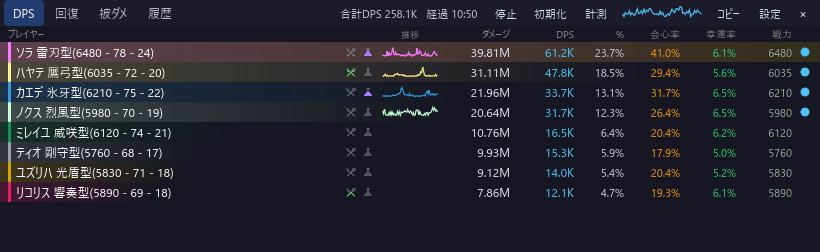
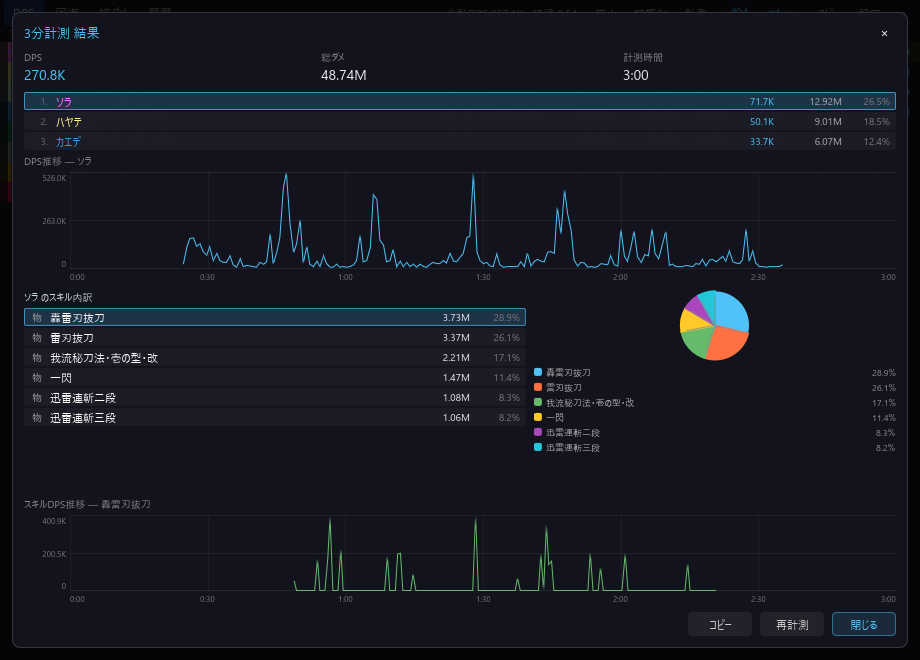
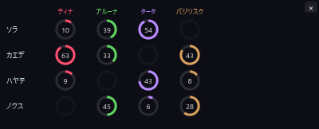
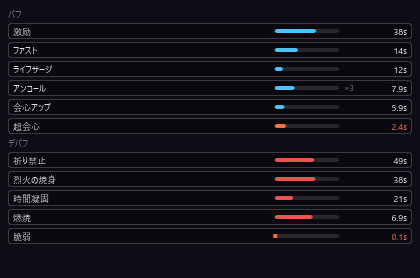
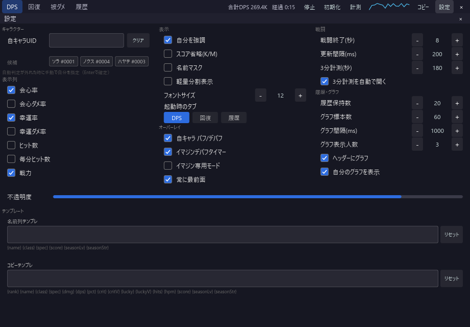

# bpsr-checker

**[日本語](./README.md) | [English](./README.en.md)**

**Blue Protocol: Star Resonance 向けの軽量 DPS チェッカー (Windows 専用)**

[](https://github.com/Rererr/bpsr-checker/releases)
[](./LICENSE)
[](https://github.com/Rererr/bpsr-checker/releases)

[](https://discord.gg/exU3gPBx3)

**Slint（Rust ネイティブ GUI）** で実装。戦闘中・計測で本当に必要な機能に絞っているため、低 CPU・低メモリで動作が軽く、長時間でも安定します。ゲーム画面の上に半透明オーバーレイ表示も可能。**外部サーバへのデータ送信は一切ありません。**

<p align="center">
  
</p>

## 主な機能

- **DPS / 回復 / 被ダメ / 履歴タブ** — 与ダメ・回復量・被ダメージをタブ切替で集計（列見出し・合計値もタブに追従）。戦闘終了後は自動でエンカウントを履歴へ保存し、**アプリを再起動しても過去ログが残る**（ディスク保存）
- **スキル別内訳** — プレイヤーをクリックすると、そのプレイヤーのスキルごとのダメージ・命中数・クリ率を表示
- **バトルイマジン名の表示** — 各プレイヤーが装備しているバトルイマジン（ティナ / アルーナ / タータ / バジリスク 等）をレベル（凸数）付きで DPS 一覧の名前列末尾に表示（例: `ソラ-ティナ(3)/アルーナ(1)`）。自分はマップ移動ごと、周囲のプレイヤーはダンジョン読込やボス部屋切替のタイミングで検知し、発動が控えめで見えにくいイマジンも漏れなく表示できる。名前列テンプレートの `{imagine}` トークンで表示位置を調整でき、不要なら削除して非表示にできる。プレイヤーをクリックして開くスキル別内訳の見出しでは常に表示
- **計測モード** — 模擬戦やボス練習向けに、戦闘開始から固定時間で集計する専用モード (デフォルト 180 秒、変更可)。計測後の結果画面では、キャラ別・スキル別の DPS 推移グラフ（時間軸・DPS目盛り付き）と、スキル内訳の円グラフ（TOP10＋その他）を確認可能。**自己ベストを計測時間ごとに自動記録**し、更新時は結果画面に「新記録！」を表示。TOP3 は金/銀/銅で強調され、日時入りの結果画像をワンクリックでコピーして Discord 等へ共有できる
- **イマジン (バトルイマジン) デバフタイマー** — ティナ / アルーナ / タータ / バジリスクの免疫デバフ残時間を独立オーバーレイで表示。既定では DPS 一覧と同期し、表示する顔ぶれ・並び順を自動追従（並び順の追従は個別に OFF 可）、ピンアイコンで各プレイヤーをタイマーから隠す/表示を切替。同期を OFF にすればピンで手動追加した相手だけを表示する従来運用に切替でき、一括クリアの導線も用意。表示するイマジン種類はパーティ構成に合わせて個別に選択可。行を詰める密表示にも対応。カラムヘッダーにカタカナ名・キャラ別識別色（ティナ赤 / アルーナ緑 / タータ紫 / バジリスク茶）付きリングで視認性を確保
- **自キャラ バフ/デバフ表示** — 自分のキャラクターに現在かかっているバフ・デバフを別ウインドウで日本語表示。残時間バー付きアイコン形式でひと目で把握可能。スタック制バフは重ね掛け数 (×N) とタイマー更新にも追従
- **自キャラ ステータス表示** — 攻撃力・会心・HP など自キャラのステータスを独立オーバーレイにリアルタイム表示。表示する項目はゲーム内パネル単位のグループで自由にカスタマイズ可（一括 ON/OFF 対応）
- **食事 / シロップ表示** — 各プレイヤーの食事・シロップバフの使用状況を DPS 一覧の名前列に縦型残時間タイマーで表示。アイコンにホバーすると効果内容と残り時間を確認可能。戦闘終了・手動リセット・アプリ再起動をまたいで残時間を保持（失効した分は自動的に消える）。設定から表示 ON/OFF 可
- **デバフタイマー専用モード (軽量)** — DPS/回復の集計を停止してデバフタイマーのみ動作させる省リソースモード
- **2 列コンパクト表示** — DPS テーブルを 2 列に分割して横幅を節約するレイアウトモード
- **DPS推移グラフ** — 各プレイヤー行の DPS 推移を小グラフで可視化
- **常に最前面表示・クリックスルー・タスクバー/トレイ切替** — オーバーレイ運用に必須。タイトルバーのボタンから最小化・最前面ピン止めをワンタッチ切替でき、ウィンドウ幅が狭いときはヘッダーが自動でアイコン表示に切り替わる。最小化は既定で**タスクトレイへ格納**（メインを最小化するとオーバーレイも一緒に退避し、トレイアイコンの左クリックまたは右クリック「メインを表示」で復帰）。設定の「タスクバーに常駐」をオンにすると、メイン・各オーバーレイが**個別のタスクバーボタン**になり、各ウィンドウの最小化ボタンでタスクバーへ最小化できる。各オーバーレイは右上の × ボタンで閉じられ（設定の表示トグルと連動）。クリックスルー（背後のゲームへクリックを素通し）はタスクトレイから切替・解除。各ウィンドウは縁ドラッグでリサイズ可能
- **オーバーレイの外観カスタマイズ** — 各オーバーレイの背景不透明度・フォント・文字サイズ・太字・文字色を本体とは独立して設定可能。文字色とアプリのアクセントカラーは HSV ピッカーで自由に調整できる
- **コピーテンプレート** — 集計結果を任意フォーマット (Discord 貼り付け等) でクリップボードへ
- **多言語対応** — 日本語 / English
- **キャラ指定** — 自動判定が外れた時は、設定パネルで自キャラの UID を直接入力するか現在のプレイヤー候補から選択して固定（名前は名前キャッシュから解決表示）

### スクリーンショット

| | |
|---|---|
| <br>**3 分計測の結果画面** — キャラ/スキル別 DPS 推移と内訳円グラフ | <br>**イマジンデバフタイマー** — 免疫デバフ残時間をキャラ別色リングで表示 |
| <br>**自キャラ バフ/デバフ表示** — 残時間バー付きアイコンで一覧 | <br>**設定パネル** — 透明度・列表示・コピーテンプレート等 |

## インストール

[Releases](https://github.com/Rererr/bpsr-checker/releases) から最新の `bpsr-checker-setup-x.x.x.exe`（インストーラ）をダウンロードして実行してください。インストール不要のポータブル版 `bpsr-checker-portable-x.x.x.zip` もあります（解凍して `bpsr-checker.exe` を実行）。

- アップデート時は起動中のアプリを終了しなくてもインストール可能です。
- 設定・履歴は再インストール後も保持されます（`%APPDATA%\bpsr-checker`）。

### 動作要件

- Windows 10 / 11 (x64)
- 管理者権限 (WinDivert カーネルドライバのロードに必要)

## 安全性・プライバシーについて

本ツールに対するよくある懸念に回答します。

### このツールを使うと BAN されますか?

**ゲーム側ファイル・メモリ・通信内容のいずれも改変しません。** 受信パケットを受動的に観測してダメージ表示文字列を再構築しているだけで、ゲームクライアントへの注入・パッチ・自動操作は一切行いません。

ただし、本ソフトウェアは**個人開発の非公式ツール**であり、運営の規約変更により将来的に黙認されなくなる可能性は否定できません。**最終的な使用判断は利用者ご自身の責任でお願いします。** (詳細は[ライセンス](#ライセンス)末尾の免責条項を参照)

### ウイルスではないですか? ウイルス対策ソフトに検出されました

**誤検知です。** カーネルレベルでパケットをキャプチャする [WinDivert](https://github.com/basil00/WinDivert) ドライバを同梱しているため、一部のウイルス対策ソフトが「ネットワーク監視ツール」として警告を出すことがあります。

例えば VirusTotal では Kaspersky が `Not-a-virus:HEUR:RiskTool.Multi.WinDivert.gen` と表示することがありますが、これは同梱の WinDivert ドライバを「リスクツール（ネットワークツール）」として分類しているもので、**マルウェアではありません**（検出名の先頭が `Not-a-virus` であることに注目してください）。

対処:
- WinDivert ドライバ (`WinDivert.dll`, `WinDivert64.sys`) およびインストールフォルダをウイルス対策ソフトの除外設定に追加してください。
- 不安な場合は[ソースコード](https://github.com/Rererr/bpsr-checker)を確認し、自分で[ビルド](#ソースからのビルド)することも可能です (GPL-3.0)。
- すべてのリリースは VirusTotal でスキャンしています（最新リリースの結果: [インストーラ](https://www.virustotal.com/gui/file/08e69135ee7403a9b9caa7e07f95ae339da10087467f5b1832eb9c560b75d52a/detection) ・ [ポータブル](https://www.virustotal.com/gui/file/b4757a4f31c0fce63354917f9b991c5cf0c2b19ee1fd9f65e8c471a5d19bfd29/detection)）。

### Chrome で「ウイルスを検出しました」と表示されダウンロードできません

Chrome のこの警告は Google Safe Browsing による判定で、上記と同じく **未署名 exe ＋ WinDivert 同梱によるレピュテーション不足が原因の誤検知**です。ダウンロードしたファイルの SHA256 が上記 VirusTotal リンクのハッシュと一致していれば、改ざんされていない正規のリリースです。

ダウンロード方法:
1. Chrome のダウンロード一覧 (`Ctrl+J`) を開き、該当項目の「⋮」→「保持する」を選択してください。
2. 「保持する」が表示されない場合は、PowerShell で直接ダウンロードできます (ブラウザのスキャンを経由しません):
   ```powershell
   irm https://github.com/Rererr/bpsr-checker/releases/download/<バージョン>/bpsr-checker-setup-<バージョン>.exe -OutFile bpsr-checker-setup.exe
   ```
3. または[リリースページ](https://github.com/Rererr/bpsr-checker/releases/latest)からポータブル版 zip を利用してください (zip 内の exe はダウンロード時のスキャンを回避できる場合があります)。

### Windows SmartScreen で「WindowsによってPCが保護されました」と表示されます

アプリへの署名 (コードサイニング、[SignPath](https://signpath.org/) 経由) を進めていますが、新規署名はレピュテーション (実行実績) が蓄積されるまでの過渡期に SmartScreen 警告が表示されることがあります。

回避手順:
1. ダイアログの「詳細情報」をクリック
2. 表示された「実行」ボタンをクリック

### 外部にデータを送信しますか?

**送信しません。** アプリ本体に HTTP クライアントライブラリは組み込まれておらず、テレメトリ・アナリティクス・クラッシュレポートの自動送信は一切行いません。すべての処理はローカルで完結します (アップデート確認のための GitHub Releases 参照を除く)。

### 動作原理 (簡略版)

1. WinDivert を **SNIFF モード** (受動観測のみ) で起動
2. ゲームサーバ宛/から流れる TCP パケットを観測
3. ペイロードを [protobuf](https://protobuf.dev/) としてデコードし、`SyncNearDeltaInfo` 等のメッセージからダメージ・回復イベントを抽出
4. UID 単位で集計し、UI に表示

詳細は [`core/src/capture/windivert.rs`](./core/src/capture/windivert.rs) を参照してください。

## 使い方

1. アプリを起動 (UAC でゲーム同様に管理者権限を要求します)
2. ゲームを起動して戦闘を開始すると、ダメージが自動検出されます
3. プレイヤー行をクリックするとスキル別の内訳を表示
4. 戦闘終了 (デフォルト 10 秒間ダメージなし) で履歴に自動保存

### タスクトレイ

タスクトレイのアイコンを**左クリックでメイン復帰**、**右クリック**でメニューを開けます。

- **クリックスルー** — オン/オフを切替。オン中は全ウィンドウがマウスを素通しするため（背後のゲームを操作可能）、**解除は必ずトレイメニューから**行います。
- **メインを表示/非表示**
- **終了**

### 設定パネル

ヘッダーの **S** ボタンから開きます。主な項目:

- 自キャラ UID の固定 / 候補からの選択
- 透明度・フォントサイズ・列の表示切替（食事 / シロップ表示の ON/OFF を含む）
- コピーテンプレート (`{name} {dmg} {dps}` 等のプレースホルダ)
- 3 分計測モードの時間設定
- イマジンデバフタイマーの表示切替 / メイン DPS との同期（並び順追従の ON/OFF・ウォッチ一括クリア）/ 表示イマジン種類の個別選択 / 行を詰める密表示 / デバフタイマー専用モード (DPS 集計を停止して軽量化) / 2 列コンパクト表示の ON/OFF
- 自キャラ バフ/デバフ表示の ON/OFF
- ウォッチリストへの追加は DPS 一覧のプレイヤー行横のピンアイコンから操作
- 起動時タブ (DPS / 回復 / 履歴)

## 既知の制約

- **起動直後 / リセット直後の周囲キャラ表示について**
  本ツールはゲームクライアントが受信したパケットをパッシブに観測する方式のため、起動・リセットの時点ですでに視界内にいるキャラについて、サーバから一度しか送られない名前・職業・装備力の情報を取得できないことがあります。
  このようなキャラは「プレイヤー#XXXX」と薄く表示され、職業はスキルから自動推定されます。過去に観測したことがある UID は 30 日間の名前キャッシュから自動復元されます。ゾーン移動や再ログインで視界に再入場すると、正しい情報が取得されます。

## トラブルシューティング

| 症状 | 対処 |
| --- | --- |
| ダメージが検出されない | 管理者権限で起動しているか確認。VPN や ping reducer (ExitLag / NoPing 等) を有効にしている場合は無効化して再試行。 |
| ウイルス対策ソフトに検出される | [上記項目](#ウイルスではないですか-ウイルス対策ソフトに検出されました)を参照。 |
| 起動しない / すぐ終了する | `WinDivert.dll` と `WinDivert64.sys` が `bpsr-checker.exe` と同じフォルダにあるか確認（インストーラ版は自動同梱）。 |
| 過去のリリースとライセンスが違う | v0.7.8 以降は GPL-3.0、それ以前は MIT ライセンスでした。([詳細](#ライセンス)) |

不具合報告・要望は [Issues](https://github.com/Rererr/bpsr-checker/issues) または [Discord](https://discord.gg/exU3gPBx3) へお寄せください。

## ソースからのビルド

```bash
# 前提: Rust stable, Protoc, Visual Studio Build Tools (Windows)

git clone https://github.com/Rererr/bpsr-checker.git
cd bpsr-checker

# WinDivert を取得 (Windows のみ)
# https://github.com/basil00/WinDivert/releases から v2.2.2 A 版を取得し、
# WinDivert.dll / WinDivert64.sys を windivert/ に配置

# 開発実行（管理者権限が必要）
cargo run -p bpsr-app

# 配布物生成（release exe＋WinDivert同梱→zip、makensis があればインストーラも）
pwsh scripts/package-slint.ps1
```

成果物は `dist-slint/`（ポータブル zip と、NSIS があればインストーラ）に生成されます。

## 関連プロジェクト

同じゲーム向けに開発されている DPS メーターは他にもあります。本プロジェクトはそれらの良い点を参考にしています。

- [winjwinj/bpsr-logs](https://github.com/winjwinj/bpsr-logs) — Rust + Tauri + Svelte、Discord コミュニティが活発
- [anying1073/StarResonanceDps](https://github.com/anying1073/StarResonanceDps) — .NET + WPF、機能豊富
- [dmlgzs/StarResonanceDamageCounter](https://github.com/dmlgzs/StarResonanceDamageCounter) — 多くの派生実装の原点

## 利用にあたって (お願い)

本ツールは**プレイヤー個人の振り返り**を目的としています。以下の用途には使用しないでください。

- 他プレイヤーのスコアを晒して中傷・煽る用途
- 野良パーティでの装備強要 / 同行拒否の根拠としての利用

DPS は装備・スキル回し・状況・ロールにより大きく変動します。数値はあくまで参考値としてご活用ください。

## 支援

開発の継続を支援したい場合は、[GitHub Sponsors](https://github.com/sponsors/Rererr) からサポートできます。

## ライセンス

本ソフトウェアは [**GNU General Public License v3.0 only (GPL-3.0-only)**](./LICENSE) の下で配布されます。

- 改変版を配布する場合は、ソースコードを同じ GPL-3.0 ライセンスで公開する必要があります。
- 著作権表示・ライセンス全文・改変内容の明示を保持してください。

> **注**: v0.7.7 以前は MIT ライセンスで配布していましたが、v0.7.8 から GPL-3.0 に変更しました。

### 免責事項

本ソフトウェアは現状のまま提供され、**明示または黙示を問わずいかなる保証もありません**。本ソフトウェアの使用または使用不能から生じる一切の損害について、作者は責任を負いません。利用は自己責任でお願いします。

Copyright (C) 2025 Rererr
