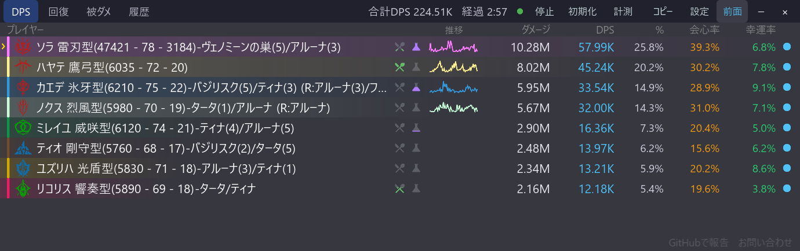

# bpsr-checker

**[日本語](./README.md) | [English](./README.en.md)**

**Blue Protocol: Star Resonance 向けの軽量 DPS チェッカー (Windows 専用)**

[](https://github.com/Rererr/bpsr-checker/releases)
[](./LICENSE)
[](https://github.com/Rererr/bpsr-checker/releases)

[](https://discord.gg/exU3gPBx3)

**Slint（Rust ネイティブ GUI）** で実装。戦闘中・計測で本当に必要な機能に絞っているため、CPU・メモリの消費が小さく、長時間でも軽快に安定して動作します。ゲーム画面の上に半透明オーバーレイ表示も可能。**外部サーバへのデータ送信は一切ありません。**

<p align="center">
  
</p>

## 主な機能

機能の詳細とスクリーンショットは、各ページに分けて掲載しています。

### 集計・計測

- [DPS・回復・被ダメ・履歴タブ](docs/features/metrics-tabs.md)
- [スキル別内訳](docs/features/skill-breakdown.md)
- [計測モード](docs/features/measurement-mode.md)
- [有効DPS列](docs/features/effective-dps.md)
- [DPS推移グラフ](docs/features/dps-trend.md)

### プレイヤー情報・バフ

- [バトルイマジン名の表示](docs/features/battle-imagine-names.md)
- [イマジンデバフタイマー](docs/features/imagine-debuff-timer.md)
- [自キャラ バフ・デバフ表示](docs/features/self-buffs-debuffs.md)
- [自キャラ ステータス表示](docs/features/self-status.md)
- [食事・シロップ表示](docs/features/food-syrup.md)
- [デバフタイマー専用モード](docs/features/imagine-only-mode.md)
- [職業アイコン表示](docs/features/class-icons.md)
- [キャラ指定](docs/features/character-selection.md)

### 表示・操作

- [行バーの表示方式](docs/features/dps-bars.md)
- [2列コンパクト表示](docs/features/compact-layout.md)
- [オーバーレイのウィンドウ操作](docs/features/overlay-window-controls.md)
- [グローバルショートカットキー](docs/features/global-shortcuts.md)
- [オーバーレイの外観カスタマイズ](docs/features/overlay-appearance.md)
- [コピーテンプレート](docs/features/copy-templates.md)

### その他

- [多言語対応](docs/features/multilanguage.md)
- [アプリ内更新](docs/features/in-app-update.md)
- [フッターのお問い合わせ導線](docs/features/contact-links.md)

## インストール

[Releases](https://github.com/Rererr/bpsr-checker/releases) から最新の `bpsr-checker-setup-x.x.x.exe`（インストーラ）をダウンロードして実行してください。インストール不要のポータブル版 `bpsr-checker-portable-x.x.x.zip` もあります（解凍して `bpsr-checker.exe` を実行）。

- アップデート時は起動中のアプリを終了しなくてもインストール可能です。
- インストーラ版は、設定パネルの「更新」から新しいバージョンの確認と適用ができます（[アプリ内更新](docs/features/in-app-update.md)）。
- 設定・履歴は再インストール後も保持されます（`%APPDATA%\bpsr-checker`）。

### 動作要件

- Windows 10 / 11 (x64)
- 管理者権限 (WinDivert カーネルドライバのロードに必要)

## 安全性・プライバシーについて

本ツールに対するよくある懸念に回答します。

### このツールを使うと BAN されますか?

**ゲーム側ファイル・メモリ・通信内容のいずれも改変しません。** 受信パケットを受動的に観測してダメージ表示文字列を再構築しているだけで、ゲームクライアントへの注入・パッチ・自動操作は一切行いません。

ただし、本ソフトウェアは**個人開発の非公式ツール**であり、運営の規約変更により将来的に黙認されなくなる可能性は否定できません。**最終的な使用判断は利用者ご自身の責任でお願いします。** (詳細は[ライセンス](#ライセンス)末尾の免責条項を参照)

### ウイルスではないですか? ウイルス対策ソフトに検出されました

**誤検知です。** カーネルレベルでパケットをキャプチャする [WinDivert](https://github.com/basil00/WinDivert) ドライバを同梱しているため、一部のウイルス対策ソフトが「ネットワーク監視ツール」として警告を出すことがあります。

例えば VirusTotal では Kaspersky が `Not-a-virus:HEUR:RiskTool.Multi.WinDivert.gen` と表示することがありますが、これは同梱の WinDivert ドライバを「リスクツール（ネットワークツール）」として分類しているもので、**マルウェアではありません**（検出名の先頭が `Not-a-virus` であることに注目してください）。

対処:
- WinDivert ドライバ (`WinDivert.dll`, `WinDivert64.sys`) およびインストールフォルダをウイルス対策ソフトの除外設定に追加してください。
- 不安な場合は[ソースコード](https://github.com/Rererr/bpsr-checker)を確認し、自分で[ビルド](#ソースからのビルド)することも可能です (GPL-3.0)。
- すべてのリリースは VirusTotal でスキャンしています（最新リリースの結果: [インストーラ](https://www.virustotal.com/gui/file/972f236c8017db4fe9329284c6ed75fbad1a7c4abc413b4da67f73204dce54a8/detection) ・ [ポータブル](https://www.virustotal.com/gui/file/dcbd77b577da3ab443c03938be6330f967e0f815ca69dcfd0555fbd9b4ccd7d5/detection)）。

### 「ウイルスが検出されました」と表示されインストーラをダウンロードできません

**ポータブル版 zip をご利用ください。** 現在この警告が出るのは**インストーラ (`bpsr-checker-setup-*.exe`) のみ**で、ポータブル版 zip とその中身 (`bpsr-checker.exe` 本体・WinDivert) は検出されません。

原因はブラウザではなく **Windows Defender** です。未署名かつ公開直後でレピュテーションが無い NSIS 形式のインストーラを、機械学習ヒューリスティックが `Trojan:Win32/Wacatac.B!ml` として誤検知します (検出名末尾の `!ml` が機械学習による推定判定であることを示します)。Chrome と Edge のどちらもダウンロード完了時に Windows 側のウイルス対策へ問い合わせるため、**ブラウザを変えても結果は同じ**です。同じ理由で、PowerShell やコマンドラインで直接ダウンロードしてもリアルタイム保護に削除されます。

どうしてもインストーラ版が必要な場合:
1. Windows セキュリティ → 「ウイルスと脅威の防止」→ 「設定の管理」→ 「除外の追加または削除」で、保存先フォルダを一時的に除外に追加してからダウンロードしてください。
2. ダウンロードしたファイルの SHA256 が上記 VirusTotal リンクのハッシュと一致することを確認してください (`Get-FileHash <ファイル> -Algorithm SHA256`)。一致していれば改ざんされていない正規のリリースです。
3. インストール後、除外設定は元に戻して構いません。

> 誤検知が確認され次第 Microsoft へ報告しており、定義ファイルの更新で解消されます。ただしリリースのたびにファイルのハッシュが変わるため、新バージョン公開直後に再発することがあります。

### Windows SmartScreen で「WindowsによってPCが保護されました」と表示されます

本アプリは現在**コードサイニング証明書による署名を行っていません**。個人開発のため証明書の取得・運用コストが見合わず、対応を検討中です。署名の無いアプリはダウンロード実績が一定数に達するまで SmartScreen の警告対象となります。

ソースコードは全て公開しており ([GPL-3.0](https://github.com/Rererr/bpsr-checker))、リリース物は VirusTotal のスキャン結果を上記に掲載しています。ご自身で[ビルド](#ソースからのビルド)して利用することも可能です。

回避手順:
1. ダイアログの「詳細情報」をクリック
2. 表示された「実行」ボタンをクリック

### 外部にデータを送信しますか?

**送信しません。** テレメトリ、アナリティクス、クラッシュレポートの自動送信は一切行いません。観測したパケットも集計結果も外部へ出ることはなく、表示に必要な処理はすべてローカルで完結します。

外部と通信するのは更新の確認とダウンロードだけです。GitHub の Releases API へ最新バージョンを問い合わせ、更新を適用するときに配布物を取得します。UID、プレイヤー名、計測結果といったこのツールが扱うデータを送ることはありません。起動時の自動確認は設定パネルの「更新」から OFF にでき、OFF のときは「更新を確認」を押したときだけ通信します。

### 動作原理 (簡略版)

1. WinDivert を **SNIFF モード** (受動観測のみ) で起動
2. ゲームサーバ宛/から流れる TCP パケットを観測
3. ペイロードを [protobuf](https://protobuf.dev/) としてデコードし、`SyncNearDeltaInfo` 等のメッセージからダメージ・回復イベントを抽出
4. UID 単位で集計し、UI に表示

詳細は [`core/src/capture/windivert.rs`](./core/src/capture/windivert.rs) を参照してください。

## 使い方

1. アプリを起動 (UAC でゲーム同様に管理者権限を要求します)
2. ゲームを起動して戦闘を開始すると、ダメージが自動検出されます
3. プレイヤー行をクリックするとスキル別の内訳を表示
4. 戦闘終了 (デフォルト 8 秒間ダメージなし) で履歴に自動保存

### タスクトレイ

タスクトレイのアイコンを**左クリックでメイン復帰**、**右クリック**でメニューを開けます。

- **クリックスルー** — オン/オフを切替。オン中は全ウィンドウがマウスを素通しする（背後のゲームを操作可能）ため、**解除は必ずトレイメニューから**行います。
- **メインを表示/非表示**
- **終了**

### 設定パネル

ヘッダーの **設定** ボタン（狭い表示ではスライダーアイコン）から開きます。主な項目:

- 自キャラ UID の固定 / 候補からの選択
- 透明度・フォントサイズ・列の表示切替（食事 / シロップ表示の ON/OFF を含む）
- コピーテンプレート (`{name} {dmg} {dps}` 等のプレースホルダ)
- 3 分計測モードの時間設定 / 計測中だけ自分の記録に絞る / 計測中だけ最初に攻撃した敵に絞る
- イマジンデバフタイマーの表示切替 / メイン DPS との同期（並び順追従の ON/OFF・ウォッチ一括クリア）/ 表示イマジン種類の個別選択 / 行を詰める密表示 / デバフタイマー専用モード (DPS 集計を停止して軽量化) / 2 列コンパクト表示の ON/OFF
- 自キャラ バフ/デバフ表示の ON/OFF
- ウォッチリストへの追加は DPS 一覧のプレイヤー行横のピンアイコンから操作
- 起動時タブ (DPS / 回復 / 履歴)
- 更新の確認と適用、最新 5 バージョンからの切り替え (起動時の自動確認は OFF にできます)

## 既知の制約

- **起動直後 / リセット直後の周囲キャラ表示について**
  本ツールはゲームクライアントが受信したパケットをパッシブに観測する方式のため、起動・リセットの時点ですでに視界内にいるキャラについて、サーバから一度しか送られない名前・職業・装備力の情報を取得できないことがあります。
  このようなキャラは「プレイヤー#XXXX」と薄く表示され、職業はスキルから自動推定されます。過去に観測したことがある UID は 30 日間の名前キャッシュから自動復元されます。読み込みが入る移動や再ログインで視界に再入場すると、正しい情報が取得されます。

- **自分の名前だけ「プレイヤー#XXXX」になることについて**
  他プレイヤーの名前は視界に入るたびに届くのに対し、自分の名前はマップに入り直したときにしか届きません。そのため、ゲームを起動した後に本ツールを立ち上げると、他の人の名前は表示されるのに自分だけ「プレイヤー#XXXX」のまま、という状態になります。放置しても直りません。
  ワープやダンジョンの出入りなど、**読み込み（ローディング）が入る移動**、または**再ログイン**を一度行えば名前が入り、以降は 30 日間の名前キャッシュから自動復元されます。

## トラブルシューティング

| 症状 | 対処 |
| --- | --- |
| ダメージが検出されない | 管理者権限で起動しているか確認。VPN や ping reducer (ExitLag / NoPing 等) を有効にしている場合は無効化して再試行。 |
| ウイルス対策ソフトに検出される | [上記項目](#ウイルスではないですか-ウイルス対策ソフトに検出されました)を参照。 |
| 起動しない / すぐ終了する | `WinDivert.dll` と `WinDivert64.sys` が `bpsr-checker.exe` と同じフォルダにあるか確認（インストーラ版は自動同梱）。 |
| 名前列のイマジン名が `...` で切れる / 名前が読めない | 名前列の幅が足りていません。ウィンドウを広げるほか、設定パネル下部の「イマジン名」からイマジンの表示名を短い略称に登録するか、「テンプレート」の名前列テンプレから `{imagine}` / `{roleSkill}` を外して表示内容を減らしてください。 |
| 過去のリリースとライセンスが違う | v0.7.8 以降は GPL-3.0、それ以前は MIT ライセンスでした。([詳細](#ライセンス)) |

不具合報告・要望は [Issues](https://github.com/Rererr/bpsr-checker/issues) または [Discord](https://discord.gg/exU3gPBx3) へお寄せください。

## ソースからのビルド

```bash
# 前提: Rust stable, Protoc, Visual Studio Build Tools (Windows)

git clone https://github.com/Rererr/bpsr-checker.git
cd bpsr-checker

# WinDivert を取得 (Windows のみ)
# https://github.com/basil00/WinDivert/releases から v2.2.2 A 版を取得し、
# WinDivert.dll / WinDivert64.sys を windivert/ に配置

# 開発実行（管理者権限が必要）
cargo run -p bpsr-app

# 配布物生成（release exe＋WinDivert同梱→zip、makensis があればインストーラも）
pwsh scripts/package-slint.ps1
```

成果物は `dist-slint/`（ポータブル zip と、NSIS があればインストーラ）に生成されます。

## 関連プロジェクト

同じゲーム向けに開発されている DPS メーターは他にもあります。本プロジェクトはそれらの良い点を参考にしています。

- [winjwinj/bpsr-logs](https://github.com/winjwinj/bpsr-logs) — Rust + Tauri + Svelte、Discord コミュニティが活発
- [anying1073/StarResonanceDps](https://github.com/anying1073/StarResonanceDps) — .NET + WPF、機能豊富
- [dmlgzs/StarResonanceDamageCounter](https://github.com/dmlgzs/StarResonanceDamageCounter) — 多くの派生実装の原点

## 利用にあたって (お願い)

本ツールは**プレイヤー個人の振り返り**を目的としています。以下の用途には使用しないでください。

- 他プレイヤーのスコアを晒して中傷・煽る用途
- 野良パーティでの装備強要 / 同行拒否の根拠としての利用

DPS は装備・スキル回し・状況・ロールにより大きく変動します。数値はあくまで参考値としてご活用ください。

## ゲーム内画像について

本ツールは非公式のファンメイドツールです。DPS一覧に表示する職業アイコン等のゲーム内画像は、
ゲーム情報を識別する目的で限定的に使用しています。著作権は各権利者に帰属します。
権利者からの申し立てがあれば、速やかに削除等の対応を行います。連絡は [Issues](https://github.com/Rererr/bpsr-checker/issues) へお願いします。

## 支援

開発の継続を支援したい場合は、[GitHub Sponsors](https://github.com/sponsors/Rererr) からサポートできます。

## ライセンス

本ソフトウェアは [**GNU General Public License v3.0 only (GPL-3.0-only)**](./LICENSE) の下で配布されます。

- 改変版を配布する場合は、ソースコードを同じ GPL-3.0 ライセンスで公開する必要があります。
- 著作権表示・ライセンス全文・改変内容の明示を保持してください。

> **注**: v0.7.7 以前は MIT ライセンスで配布していましたが、v0.7.8 から GPL-3.0 に変更しました。

### 免責事項

本ソフトウェアは現状のまま提供され、**明示または黙示を問わずいかなる保証もありません**。本ソフトウェアの使用または使用不能から生じる一切の損害について、作者は責任を負いません。利用は自己責任でお願いします。

Copyright (C) 2025 Rererr
