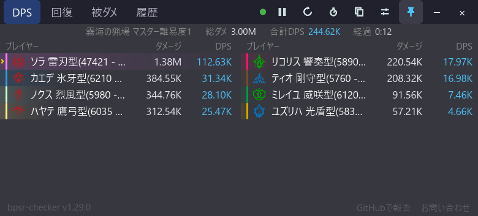
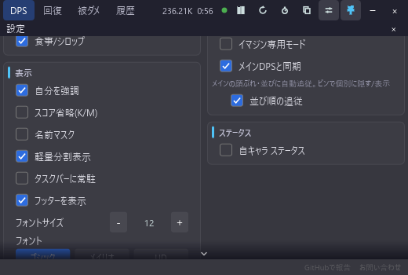

# 2列コンパクト表示

[機能一覧に戻る](../../README.md#主な機能)

DPS テーブルを左右2列に分割し、同じ人数をより小さい横幅で表示するレイアウトモードです。狭いオーバーレイや、ゲーム画面の端に置く運用に向いています。

通常表示との切り替えは設定から行います。コンパクト表示では、各行を名前・ダメージ・DPS に絞った固定構成で左右へ振り分けます。2列の上には、コンテンツ名・総ダメ・合計DPS・経過を並べた1行のサマリーが入ります（[合計行とコンテンツ名](total-row-content-name.md)）。

名前の欄には、名前が数値に重ならないよう、少なくとも2文字分の幅を確保します。文字サイズを大きくするとこの幅も大きくなるため、ウィンドウの最小幅が広がります。

## 使い方

1. 設定パネルで軽量分割表示を ON にします。
2. オーバーレイの幅をゲーム画面に合わせます。
3. 名前が長く切れる場合は、ウィンドウを広げるか名前列テンプレートを短くします。

## スクリーンショット

  

名前・ダメージ・DPS に絞った一覧を左右2列で表示します。上部のサマリー行に、コンテンツ名と合計値が並びます。

  

軽量分割表示は設定パネルの表示欄から切り替えます。上の画像では、軽量分割表示が有効になった状態も確認できます。

## 関連

- [行バーの表示方式](dps-bars.md)
- [オーバーレイの外観カスタマイズ](overlay-appearance.md)
