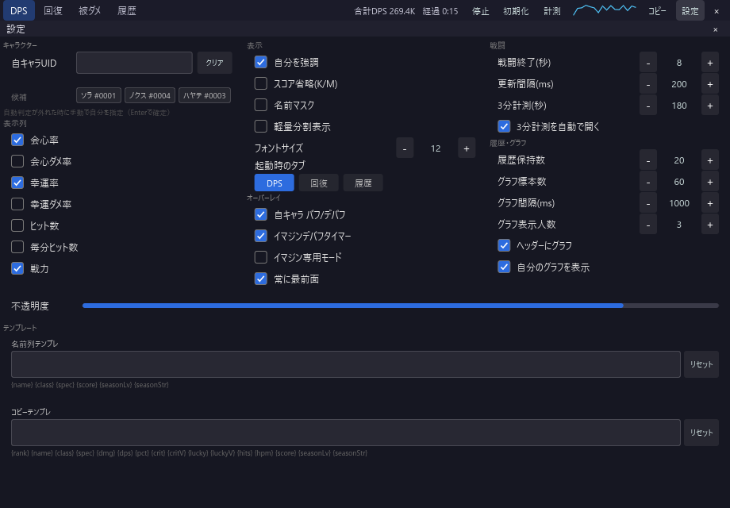

# フッターのお問い合わせ導線

[機能一覧に戻る](../../README.md#主な機能)

メイン画面下部の半透明フッターから、開発者へのお問い合わせフォームと GitHub Issue の報告ページを既定ブラウザで開けます。質問、再現手順付きの不具合報告、要望の入口をアプリ内にまとめています。

フッターは設定から非表示にできます。報告するときは、OS、アプリのバージョン、再現手順、必要ならスクリーンショットを添えると確認が早くなります。

## 使い方

1. メイン画面下部の問い合わせまたは GitHub 報告をクリックします。
2. 既定ブラウザで開いたフォームや Issue に内容を入力します。
3. フッターを隠したい場合は、設定で表示を OFF にします。

## スクリーンショット

  

フッターはメイン画面の下端に表示される問い合わせ導線です。

  

設定パネルからフッター表示の ON/OFF を切り替えられます。

## 関連

- [多言語対応](multilanguage.md)
- [オーバーレイのウィンドウ操作](overlay-window-controls.md)
