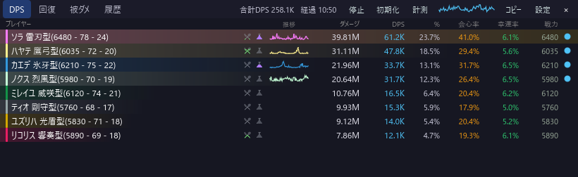
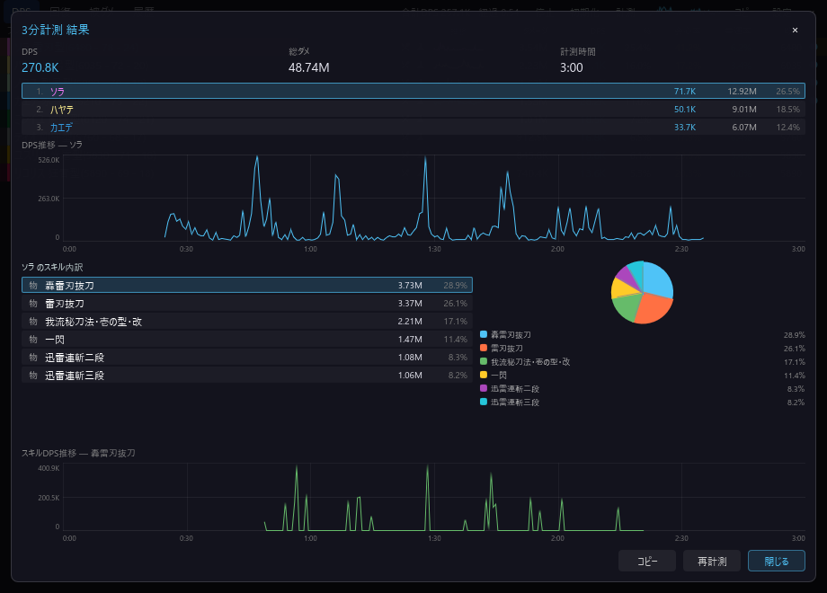

# DPS推移グラフ

[機能一覧に戻る](../../README.md#主な機能)

DPS 一覧の各プレイヤー行に、時間ごとの DPS 推移を小さなスパークラインで表示します。現在の火力だけでなく、戦闘中に伸びたか落ちたかを一覧のまま把握できます。

計測モードの結果画面では、より大きい折れ線グラフでキャラクター別・スキル別の推移を確認できます。プレイヤーやスキルを選ぶと、グラフの対象が切り替わります。

## 使い方

1. DPS 一覧で行の推移グラフを確認します。
2. 詳細に見るときは計測モードを使います。
3. 結果画面でプレイヤー、スキルの順に選択します。

## スクリーンショット

  

一覧の推移列に、プレイヤーごとの小グラフが表示されます。

  

計測結果では時間軸付きの大きな推移グラフを表示します。

## 関連

- [計測モード](measurement-mode.md)
- [スキル別内訳](skill-breakdown.md)
