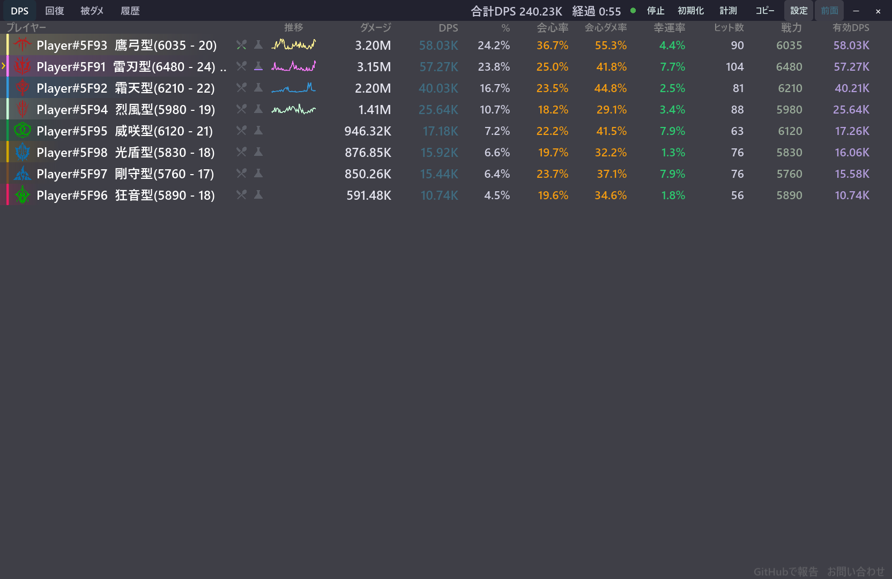

# 有効DPS列

[機能一覧に戻る](../../README.md#主な機能)

通常の DPS と並べて、実際に攻撃していた時間だけを分母にした有効DPSを表示できます。移動やギミック対応で手が止まる実戦では、戦闘全体の結果と、攻撃中の火力を分けて確認できます。

通常 DPS は計測・エンカウントの経過時間を基準にし、有効DPSは攻撃時間を基準にします。用途が異なる値なので、どちらか一方を正解として扱わず、戦闘条件と合わせて見ます。

## 使い方

1. 設定パネルの列表示で有効DPSを ON にします。
2. DPS 一覧で通常 DPS と有効DPSを見比べます。
3. 待機時間を含む貢献度は通常 DPS、攻撃中の出力は有効DPSで確認します。

## スクリーンショット

  

DPS 一覧の列は設定に応じて切り替えられます。

  

列表示の設定で、必要な情報だけを残して横幅を調整できます。

## 関連

- [DPS・回復・被ダメ・履歴タブ](metrics-tabs.md)
- [行バーの表示方式](dps-bars.md)
