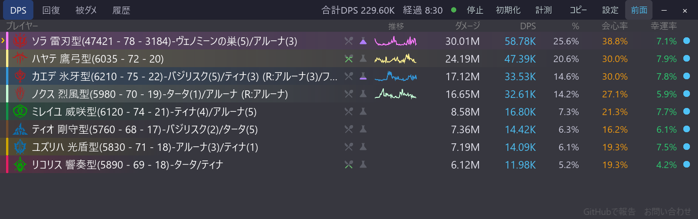
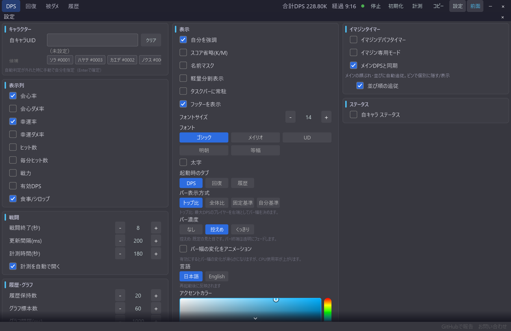

# 食事・シロップ表示

[機能一覧に戻る](../../README.md#主な機能)

各プレイヤーの食事・シロップバフの使用状況を、DPS 一覧の名前列に縦型の残時間タイマーとして表示します。アイコンにホバーすると、種類と残り時間を確認できます。

残り時間は戦闘終了、手動リセット、アプリ再起動をまたいで保持されます。期限切れのバフは自動で消えます。表示は設定から ON/OFF できます。

先に食事を済ませていた PT メンバーも、視界に入った時点で残り時間つきで表示されます。ダメージを出していないプレイヤーの行は、既定では自分と PT メンバーのみ表示します（設定「食事/シロップの表示をPTメンバーのみにする」をオフにすると、視界に入った全プレイヤーを表示します。ダメージを出したプレイヤーは設定に関係なく表示されます）。

## 使い方

1. 設定パネルで食事/シロップを ON にします。
2. DPS 一覧の名前列でタイマーアイコンを確認します。
3. 詳細を知りたいアイコンへカーソルを合わせます。

## スクリーンショット

  

食事・シロップのタイマーは、名前列の情報と同じ場所に表示されます。

  

設定パネルの表示欄からまとめて切り替えられます。

## 関連

- [DPS・回復・被ダメ・履歴タブ](metrics-tabs.md)
- [オーバーレイの外観カスタマイズ](overlay-appearance.md)
