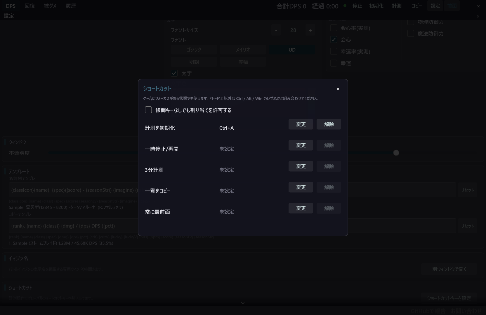
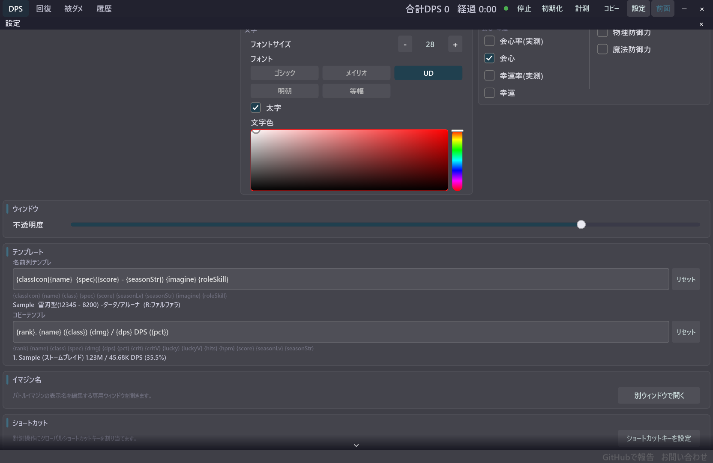

# グローバルショートカットキー

[機能一覧に戻る](../../README.md#主な機能)

ゲームにフォーカスがある状態でも使えるショートカットキーを、計測の初期化、一時停止・再開、3分計測の開始・キャンセル、一覧コピー、常に最前面の切り替えに割り当てられます。

既定ではすべて未設定です。F1〜F12 以外のキーは Ctrl・Alt・Win との組み合わせが基本ですが、設定ダイアログで修飾キーなしの単独割り当てを許可できます。

## 使い方

1. 設定パネルのグローバルショートカットを開きます。
2. 操作ごとにキーを登録します。
3. 単独キーを使う場合は、修飾キーなしを許可する設定を ON にします。
4. ゲームにフォーカスを戻して動作を確認します。

ゲーム側のキー操作と競合する可能性があるため、普段使わないキーや組み合わせを選んでください。

## スクリーンショット

  

グローバルショートカットは設定パネルから登録・変更します。

  

登録したキーで、ゲーム中でもメイン画面の計測やコピーを操作できます。

## 関連

- [計測モード](measurement-mode.md)
- [オーバーレイのウィンドウ操作](overlay-window-controls.md)
