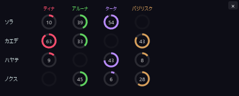

# デバフタイマー専用モード

[機能一覧に戻る](../../README.md#主な機能)

DPS と回復の集計を停止し、イマジンデバフタイマーだけを動かす省リソースモードです。集計処理が不要な場面でも、デバフ残時間の監視を続けられます。

有効中は DPS 一覧に「イマジン専用モード中です」と表示されるため、数値が出ない状態を不具合と取り違えません。表示される案内のボタンから、その場で通常モードへ戻せます。

## 使い方

1. 設定パネルでイマジン専用モードを ON にします。
2. イマジンデバフタイマーで必要な対象を確認します。
3. 集計へ戻すときは案内の解除ボタンを押すか、設定で OFF にします。

このモードはイマジンデバフタイマーと排他的に動作します。通常の DPS が必要な戦闘では OFF にしてください。

## スクリーンショット

  

専用モードでは、集計を止めたままタイマー表示を確認できます。

  

設定パネルのイマジンタイマー欄から切り替えます。

## 関連

- [イマジンデバフタイマー](imagine-debuff-timer.md)
- [DPS・回復・被ダメ・履歴タブ](metrics-tabs.md)
