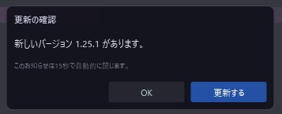
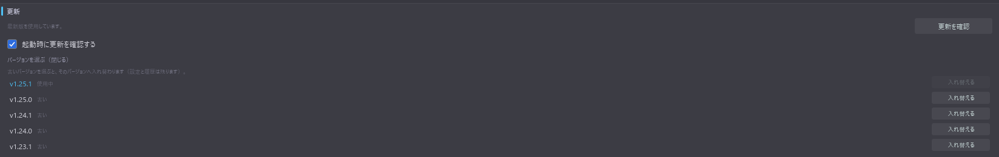
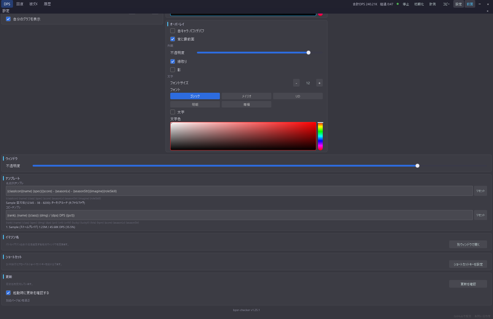

# アプリ内更新

[機能一覧に戻る](../../README.md#主な機能)

設定パネルの「更新」から、新しいバージョンが出ているかを確認できます。インストーラ版なら、そのまま「更新する」を押すだけでダウンロードから入れ替えまで進みます。新しいバージョンへ更新したときは、完了後にアプリが起動し直します。ポータブル版は実行中のファイルを自分自身で置き換えられないため、確認と Releases ページへの案内までを行います。

確認の結果は画面上部のお知らせで伝えます。「OK」を押すか、15 秒経つと自動的に閉じます。起動時の自動確認は既定で ON ですが、最新版だったときは何も出しません。お知らせが出るのは、新しいバージョンが見つかったときと、「更新を確認」を自分で押したときだけです。更新があるあいだは、ヘッダーの設定ボタンにも小さな点が付きます。

ダウンロードした配布物は、GitHub が公開している SHA-256 と照合してから実行します。一致しなければファイルを削除して中断するので、ウイルス対策ソフトに隔離されるなどして壊れたファイルを、そのまま実行することはありません。アプリが自分を終了するのは、この照合を通ってインストーラを起動できたあとだけです。

## バージョンを選ぶ

「別のバージョンを選ぶ」を開くと、公開されている新しい順に 5 バージョンが並びます。使用中の版には印が付き、ほかの行の「入れ替える」でそのバージョンへ切り替わります。新しい版へ上げるだけでなく、不具合に当たったときに前の版へ戻す用途にも使えます。設定と履歴は `%APPDATA%\bpsr-checker` に残るため、どの版へ入れ替えても引き継がれます。

v1.25.1 以前のインストーラは、入れ替えたあとにアプリを起動し直す処理を持っていません。古い版へ戻したときにアプリが自動で起動しない場合は、スタートメニューから起動してください。

ポータブル版ではボタンが「ページを開く」になり、そのバージョンの Releases ページを開きます。

## 使い方

1. ヘッダーの設定ボタンから設定パネルを開き、最下部の「更新」まで進みます。
2. 「更新を確認」を押します。結果はお知らせで表示されます。
3. 新しいバージョンがあるインストーラ版では、「更新する」でダウンロードと入れ替えが始まります。進捗と失敗も同じお知らせに出ます。
4. ポータブル版では「ダウンロード」から Releases ページを開き、zip を展開して入れ替えます。
5. 前の版へ戻したいときは「別のバージョンを選ぶ」から選びます。
6. 起動時に確認したくない場合は「起動時に更新を確認する」を OFF にします。

## スクリーンショット

  

お知らせは「OK」か 15 秒で閉じます。インストーラ版では、ここから直接更新できます。

  

「別のバージョンを選ぶ」を開くと、最新 5 バージョンから選んで入れ替えられます。

  

更新セクションは設定パネルの最下部、バージョン表示の直上にあります。

## 関連

- [フッターのお問い合わせ導線](contact-links.md)
- [多言語対応](multilanguage.md)
