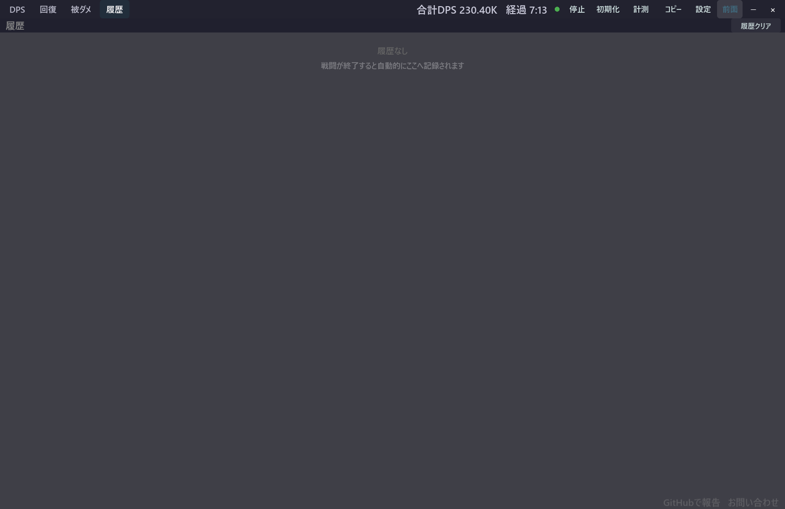

# DPS・回復・被ダメ・履歴タブ

[機能一覧に戻る](../../README.md#主な機能)

戦闘中の集計を、DPS（与ダメージ）・回復・被ダメージのタブで切り替えて確認できます。各タブで列見出しと合計値も切り替わるため、同じ一覧のまま役割ごとの状況を比較できます。

戦闘が終わるとエンカウントが履歴へ自動保存されます。履歴タブではエンカウントを開いてプレイヤーやスキルの内訳を確認でき、保存された履歴はアプリを再起動しても残ります。

## 使い方

1. メイン画面上部の DPS・回復・被ダメ・履歴から表示したいタブを選びます。
2. 履歴タブではエンカウント見出しをクリックして展開します。
3. 履歴を消去するときは、履歴タブの履歴クリアを使います。

## スクリーンショット

  

メイン画面のタブ切替と、プレイヤーごとの集計を確認できます。回復・被ダメージ・履歴も同じ画面構成で表示されます。

  

設定パネルでは、起動時に開くタブを DPS・回復・履歴から選べます。

## 関連

- [スキル別内訳](skill-breakdown.md)
- [計測モード](measurement-mode.md)
