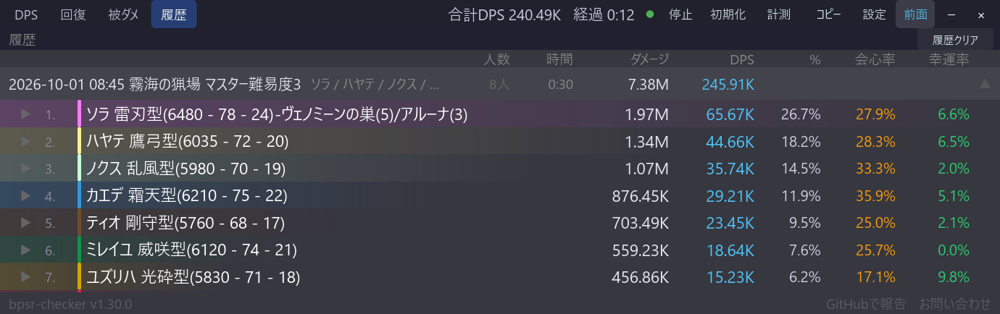

# DPS・回復・被ダメ・履歴タブ

[機能一覧に戻る](../../README.md#主な機能)

戦闘中の集計を、DPS（与ダメージ）・回復・被ダメージのタブで切り替えて確認できます。各タブで列見出しと合計値も切り替わるため、同じ一覧のまま役割ごとの状況を比較できます。

DPS・回復・被ダメの一覧には、合計DPS・総ダメージ・経過時間とコンテンツ名を示す合計行が入ります（[合計行とコンテンツ名](total-row-content-name.md)）。

戦闘が終わるとエンカウントが履歴へ自動保存されます。履歴タブではエンカウントを開いてプレイヤーやスキルの内訳を確認でき、保存された履歴はアプリを再起動しても残ります。

## 履歴の見方

各エンカウントの見出しは「日時　コンテンツ名」の形式です（例：2026-09-30 13:51 霧海の猟場 マスター難易度3）。続けて参加したプレイヤーの名前、計測時間・DPS・総ダメージ・人数が並びます。コンテンツ名は戦闘を始めた時点のマップから決まります。マスターの段階は、ダンジョン入場時の通知から取得します。段階が記録されていない場合（旧記録など）は、数字を付けずに「マスター難易度」と表示します。コンテンツ名が記録されていない古い履歴は、日時だけの見出しになります。人数は、日本語表示では「8人」、English 表示では数字だけで表示します。

見出しを展開すると、プレイヤーごとの行が順位付きで並びます。この行は DPS 一覧と同じ見た目です。

- 名前は、メインの名前テンプレートから職業アイコンを除いた表記です。アイコンは表示しません。
- 職業色のバーと、ダメージ・DPS・割合を表示します。
- 会心率や有効DPSなどのオプション列は、メインの列設定に合わせて表示・非表示が変わります。有効DPS の記録が無い古い履歴では、有効DPS 列は「-」になります。

スキルの記録があるプレイヤーは、行をクリックするとその下にスキル別の行が展開されます。

## 使い方

1. メイン画面上部の DPS・回復・被ダメ・履歴から表示したいタブを選びます。
2. 履歴タブではエンカウント見出しをクリックして展開します。
3. 履歴を消去するときは、履歴タブの履歴クリアを使います。

## スクリーンショット

  

メイン画面のタブ切替と、プレイヤーごとの集計を確認できます。列見出しの下の合計行に、コンテンツ名と合計値が出ます。回復・被ダメージも同じ画面構成で表示されます。

  

実際に保存された計測結果が、日時とコンテンツ名の見出しで、時間・DPS・総ダメージ・人数とともに履歴へ並びます。

  

見出しを展開すると、DPS 一覧と同じ見た目でプレイヤーごとの行が並びます。

## 関連

- [合計行とコンテンツ名](total-row-content-name.md)
- [スキル別内訳](skill-breakdown.md)
- [計測モード](measurement-mode.md)
