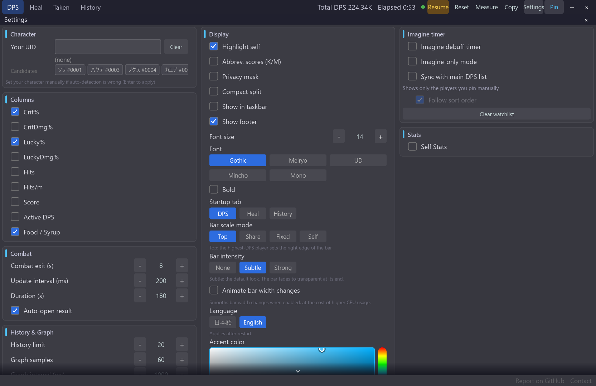

# 多言語対応

[機能一覧に戻る](../../README.md#主な機能)

画面表示は日本語と English に切り替えられます。DPS、回復、被ダメ、履歴、設定、オーバーレイなど、日常的に使う画面を同じ機能構成のまま利用できます。

機能の設定値や履歴データは、表示言語を切り替えてもそのまま保持されます。ゲーム内の固有名詞や検知データは、表示言語に応じた表示へ切り替わります。

## 使い方

1. 設定パネルで言語を Japanese または English に切り替えます。
2. アプリを再起動して変更を反映します。
3. メイン画面とオーバーレイの表示を確認し、必要に応じてフォントや文字サイズを調整します。

日本語表示では日本語フォント、英語表示では英語文字を含むフォントが読みやすい設定です。

## スクリーンショット

  

再起動後は、メイン画面のタブ、列、操作名が英語表示になります。

  

設定パネルにも選択中の言語が反映されます。言語欄には、変更が再起動後に適用されることも表示されます。

## 関連

- [オーバーレイの外観カスタマイズ](overlay-appearance.md)
- [DPS・回復・被ダメ・履歴タブ](metrics-tabs.md)
