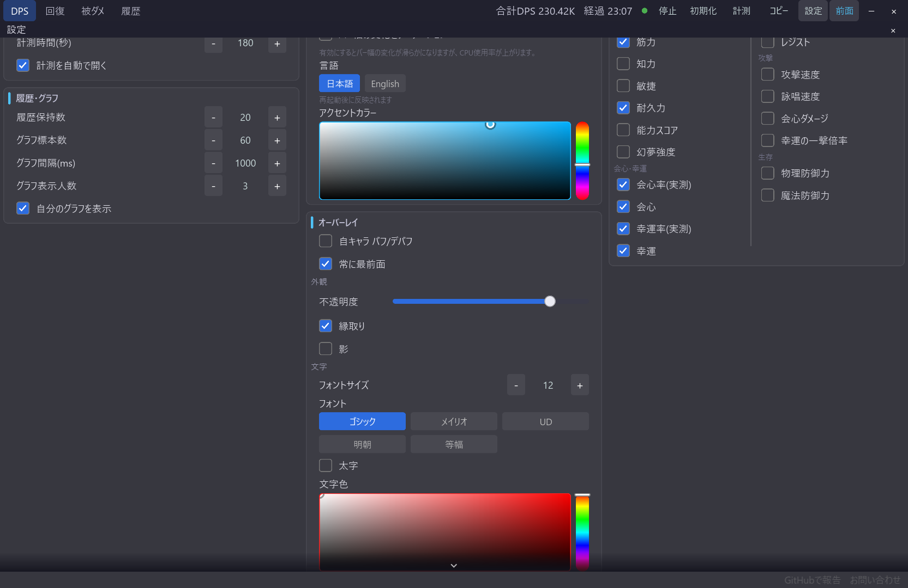
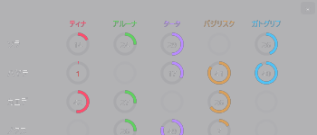

# オーバーレイの外観カスタマイズ

[機能一覧に戻る](../../README.md#主な機能)

各オーバーレイの背景不透明度、フォント、文字サイズ、太字、文字色を、メイン画面とは独立して設定できます。文字色とアプリのアクセントカラーは HSV ピッカーで調整できます。

ゲーム画面の明るさや背景に合わせて不透明度と文字色を調整し、情報が読める範囲でオーバーレイを薄くできます。完全透明にするとクリック透過になるため、操作が必要な窓では注意してください。

## 使い方

1. 設定パネルのオーバーレイ欄を開きます。
2. 背景不透明度、フォント、サイズ、太字、文字色を調整します。
3. 必要なら文字の縁取りや影、アクセントカラーを調整します。
4. 変更後の各オーバーレイをゲーム画面上で確認します。

## スクリーンショット

  

設定パネルでは、オーバーレイ用の外観をまとめて調整できます。

  

文字色と背景の見え方は、ゲーム画面の上に置いたときの視認性を基準に調整します。

## 関連

- [オーバーレイのウィンドウ操作](overlay-window-controls.md)
- [自キャラ バフ・デバフ表示](self-buffs-debuffs.md)
