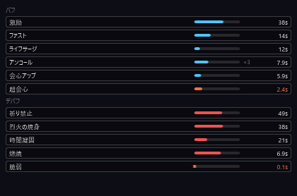
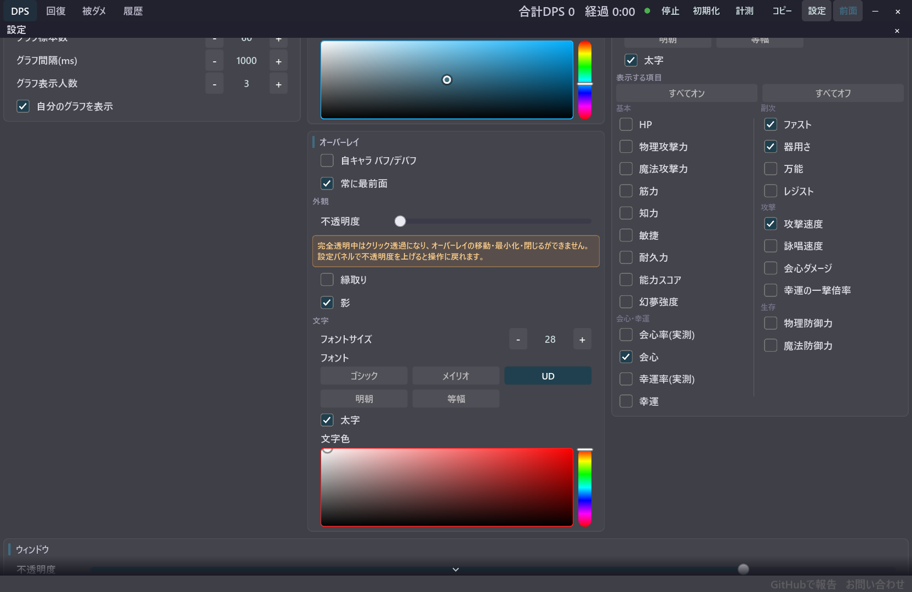

# 自キャラ バフ・デバフ表示

[機能一覧に戻る](../../README.md#主な機能)

自分のキャラクターに現在かかっているバフとデバフを、別ウィンドウで日本語表示します。アイコンと残時間バーを並べるため、戦闘中に更新状況をひと目で確認できます。

スタック制バフは重ね掛け数を ×N で表示し、効果時間の更新にも追従します。メイン画面とは独立したオーバーレイなので、ゲーム画面の見やすい位置へ移動して使えます。

## 使い方

1. 設定パネルで自キャラ バフ/デバフを ON にします。
2. 表示されたオーバーレイをゲーム画面の邪魔にならない場所へ移動します。
3. 必要に応じてフォント、文字サイズ、不透明度を調整します。

## スクリーンショット

  

バフとデバフを分け、残時間バーとスタック数を表示します。

  

設定パネルのオーバーレイ欄から表示を切り替えます。

## 関連

- [自キャラ ステータス表示](self-status.md)
- [オーバーレイの外観カスタマイズ](overlay-appearance.md)
