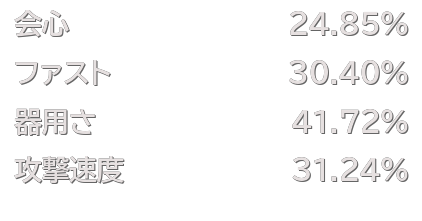

# 自キャラ ステータス表示

[機能一覧に戻る](../../README.md#主な機能)

攻撃力、会心、HP など、自分のキャラクターのステータスを独立オーバーレイでリアルタイム表示します。表示項目はゲーム内パネル単位のグループから選べ、一括 ON/OFF にも対応します。

ビルド変更や食事・バフの適用後に、ゲーム内パネルを開かずに主要ステータスの変化を確認できます。表示する項目を絞ることで、戦闘中の小さな確認用オーバーレイとして使えます。

## 使い方

1. 設定パネルの自キャラ ステータス欄を ON にします。
2. 表示したいステータスグループを選びます。
3. オーバーレイを移動し、文字サイズや不透明度を調整します。

## スクリーンショット

  

設定パネルでは、自キャラ情報の表示項目をグループ単位で切り替えられます。

  

別の自キャラ用オーバーレイも、ゲーム画面の近くに固定できます。

## 関連

- [自キャラ バフ・デバフ表示](self-buffs-debuffs.md)
- [オーバーレイの外観カスタマイズ](overlay-appearance.md)
