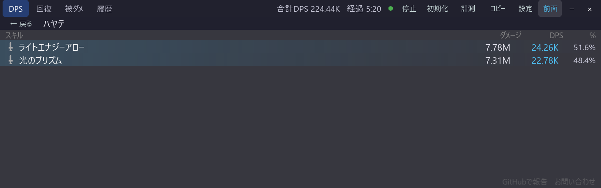
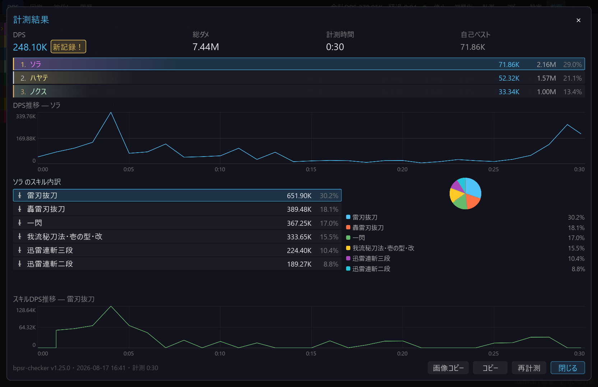

# スキル別内訳

[機能一覧に戻る](../../README.md#主な機能)

プレイヤー行をクリックすると、そのプレイヤーのスキルごとのダメージ、DPS、構成比を確認できます。どのスキルが総ダメージを作っているかを、戦闘中や戦闘後に振り返るための画面です。

計測モードの結果画面では、スキル一覧の行を選んで、対象スキルの DPS 推移グラフへ切り替えることもできます。スキル内訳は TOP10 とその他にまとめた円グラフでも確認できます。

## 使い方

1. DPS 一覧でプレイヤー行をクリックします。
2. スキルのダメージ量、DPS、構成比を確認します。
3. 計測結果ではプレイヤーを選び、スキル行をクリックして推移を切り替えます。

## スクリーンショット

  

通常の DPS 一覧でプレイヤー行を開くと、スキル名・ダメージ・DPS・構成比が表示されます。

  

計測結果ではプレイヤーとスキルを選び、DPS 推移と構成比を詳しく確認できます。

## 関連

- [DPS・回復・被ダメ・履歴タブ](metrics-tabs.md)
- [計測モード](measurement-mode.md)
