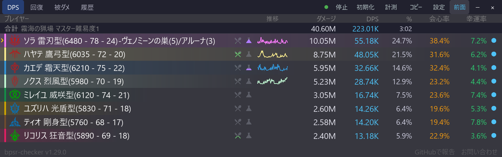

# 合計行とコンテンツ名

[機能一覧に戻る](../../README.md#主な機能)

DPS・回復・被ダメージの一覧に、一覧に並ぶプレイヤー全員の合計を1行で示す合計行を表示できます。合計DPS・総ダメージ・経過時間を、プレイヤー行をスクロールしても隠れない位置に固定して確認できます。

合計行には、計測中のコンテンツ名（例：霧海の猟場 マスター難易度3）も並びます。どの場所での計測かを、画面を見るだけで判別できます。マスターの段階は、ダンジョン入場時の通知から取得します。

## 合計行の見方

通常の一覧では、列見出しの直下に「合計」の行が入ります。左にコンテンツ名、ダメージ・DPS・%の各列の位置に総ダメージ・合計DPS・経過時間が並びます。会心率などのオプション列は、表示していても合計行では空欄です。

通常の一覧では、回復タブ・被ダメタブに切り替えると列見出しが切り替わります。2列コンパクト表示のサマリー行とヘッダー右の表示では、ラベルが回復タブで総回復・合計HPS、被ダメタブで総被ダメ・合計被DPS に切り替わります。

2列コンパクト表示では、2列の上に全幅の1行が入り、「コンテンツ名　総ダメ　合計DPS　経過」の順に並びます。列見出しが無い行なので、数値には短いラベルが付きます。

幅が狭いときは、コンテンツ名が先に省略されます。

## コンテンツ名の決まり方

- コンテンツ名は、戦闘の集計が始まった時点のマップで決まります。戦闘の途中でマップが変わっても、その戦闘の表示は変わりません。
- 起動してから最初の戦闘が始まるまでと、初期化してから次の戦闘が始まるまでは、コンテンツ名が空になります。
- アプリの起動直後など、マップをまだ検出できていないうちに始まった戦闘では、その戦闘のあいだコンテンツ名は空のままです。
- マスターの段階を取得できていないときは、数字を付けずに「マスター難易度」と表示します。ダンジョンに入ったあとでアプリを起動した場合や、段階を記録する前の旧バージョンで保存した履歴が該当します。
- 名前が分からないマップは、`#` に続けてマップの番号（例：`#1234`）で表示します。
- 表示言語が English のときは、英語の名前で表示します。切り替えは再起動後に反映されます。

コンテンツ名は履歴の見出しにも使われます。詳しくは [DPS・回復・被ダメ・履歴タブ](metrics-tabs.md) を参照してください。

## 合計行が出ないとき

合計行は、DPS・回復・被ダメの一覧と2列コンパクト表示でだけ出ます。スキル内訳・履歴・設定を開いている間は出ません。設定で合計行を OFF にした場合も出ません。

これらの場合は、ヘッダーの右側に合計DPSと経過時間を表示します。狭いウィンドウでは「合計DPS」などのラベルを省いて数値だけにし、それでも収まらない幅では非表示になります。

## 使い方

1. 設定パネルの表示欄にある「合計行を表示」で、ON/OFF を切り替えます。既定は ON です。
2. 合計行のコンテンツ名が長く切れる場合は、ウィンドウを広げます。

## スクリーンショット

  

列見出しの直下に、コンテンツ名と総ダメージ・合計DPS・経過時間が並びます。

  

2列コンパクト表示では、2列の上にコンテンツ名・総ダメ・合計DPS・経過が1行で並びます。

## 関連

- [DPS・回復・被ダメ・履歴タブ](metrics-tabs.md)
- [2列コンパクト表示](compact-layout.md)
- [計測モード](measurement-mode.md)
